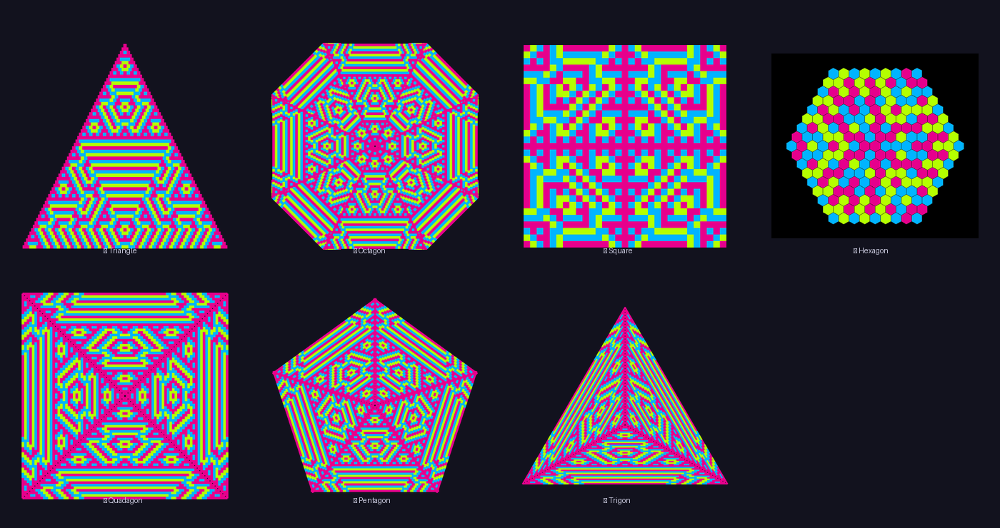
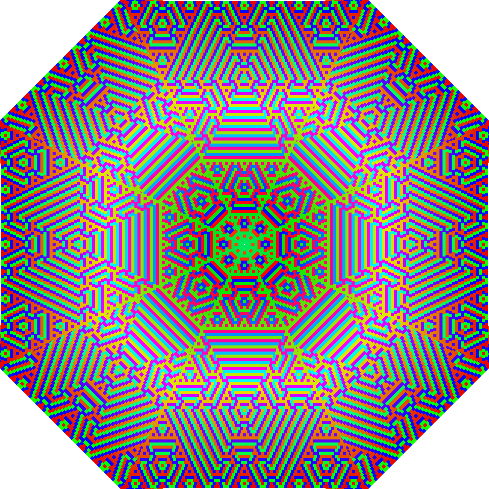
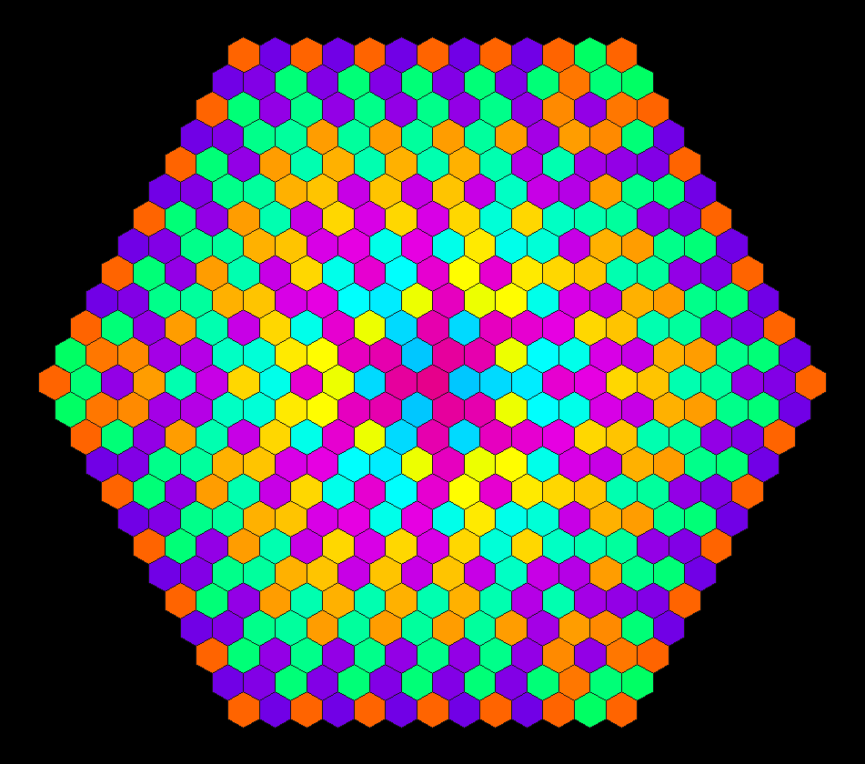
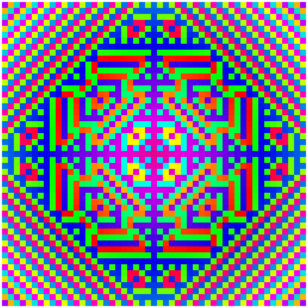
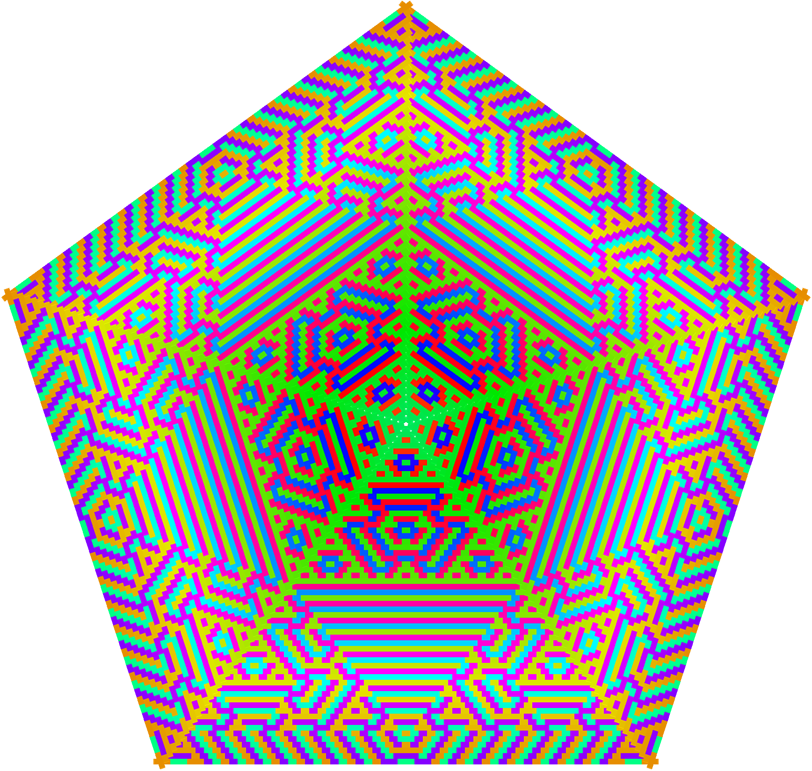
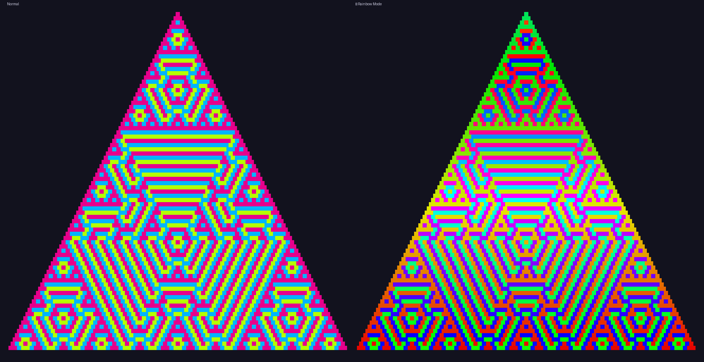

```markdown
<div align="center">

# 🔺✨ Pattern Forge

### Geometric Pattern Generator from Color Substitution Rules

[](https://your-app.streamlit.app)
[](https://python.org)
[](LICENSE)


**Create mesmerizing geometric fractals by defining simple color rules.**
7 shapes • 2–5 colors • Rainbow mode • Animated growth • Infinite possibilities

[🚀 Try it Live](https://your-app.streamlit.app) · [📖 How It Works](#-how-it-works) · [🎨 Gallery](#-gallery)

</div>

---

## ✨ Features

| Feature | Description |
|---------|-------------|
| 🔺 **7 Geometric Shapes** | Triangle, Octagon, Square, Hexagon, Quadagon, Pentagon, Trigon |
| 🎨 **2–5 Color Palettes** | Full color picker with randomize option |
| 📋 **Visual Rule Editor** | Click-to-edit rule table — no coding required |
| 🌈 **Rainbow Mode** | Cyclic hue shifting creates stunning gradients |
| 🎬 **GIF Animation** | Watch patterns grow with zoom-out and rotation effects |
| 🔄 **Symmetric Rules** | Mirror rules for perfectly balanced patterns |
| 🎲 **Random Noise** | Add controlled chaos with adjustable scale |
| ⬇️ **Export PNG/GIF** | Download high-resolution outputs instantly |

---

## 🧠 How It Works

The core idea is beautifully simple: **every cell's color is determined by its two neighbors and a lookup rule.**

### Step 1: Define a Rule Table

For *n* colors, you create an *n×n* table. Each cell says: *"When color A meets color B, produce color C."*


### Step 2: Pick Adjacent Pair

As the pattern grows row by row, each new cell looks at its two parents:


### Step 3: Look Up Result

The rule table maps the pair → result color. Repeat for every cell, every row:


### Step 4: Watch Complexity Emerge

From those simple rules, intricate fractal-like structures emerge:


> 🤯 **That's it.** No complex algorithms — just color substitution applied recursively. The complexity is *emergent*.

---

## 🎨 Gallery

### All 7 Shapes (same rule, different geometry)



<details>
<summary>🔸 Individual Shape Showcases</summary>

| Octagon | Hexagon | Square | Pentagon |
|:-------:|:-------:|:------:|:--------:|
|  |  |  |  |

</details>

### 🌈 Rainbow Mode

Toggle rainbow mode to shift hues based on position — turns any pattern into a psychedelic masterpiece:



### 🎬 Animated Growth

Watch patterns unfold in real-time with customizable speed, zoom, and rotation:

| Triangle Growth | Octagon Spin | Hexagon Bloom | Square Expand |
|:---------------:|:------------:|:-------------:|:-------------:|
|  |  |  |  |

### 🎨 More Colors = More Complexity

| 3 Colors | 4 Colors | 5 Colors |
|:--------:|:--------:|:--------:|
|  |  |  |

---

## 🚀 Quick Start

### Play Online (No Install)

👉 **[Open in Streamlit](https://your-app.streamlit.app)** — zero setup, start creating immediately.

### Run Locally

```bash
# Clone the repo
git clone https://github.com/YOUR_USERNAME/pattern-forge.git
cd pattern-forge

# Install dependencies
pip install streamlit pillow

# Run!
streamlit run app.py
```

That's it. No complex build steps.

---

## ⚙️ Controls Guide

### Shape Selection
Choose from 7 geometric templates in the sidebar. Each applies the same rule logic to a different lattice structure.

### Rule Source
- **Random** — Click "New Random Rule" for instant inspiration
- **Custom** — Type a rule string directly (e.g., `"213132321"` for 3 colors)

### Visual Rule Editor
Expand the editor to click-to-change any rule cell. The colored circles show input pairs, and buttons select the output.

### Boundary Modes
| Mode | Behavior |
|------|----------|
| Fixed (1) | All edges are color 1 |
| Cyclic | Edge color cycles through palette |
| Random | Each edge gets a random color |

### Advanced Settings
| Setting | Effect |
|---------|--------|
| **Symmetric Rule** | Rule[A,B] = Rule[B,A] — creates balanced patterns |
| **Random Scale** | 0.0 = pure rule, 1.0 = pure noise |
| **Wait Until** | Apply noise only after N rows/generations |
| **Rainbow Mode** | Shift hue based on position |

### Animation Settings
| Setting | Effect |
|---------|--------|
| **Start/End** | Row or generation range to animate |
| **Frame Duration** | Milliseconds per frame (lower = faster) |
| **Zoom Out** | Each frame fills the canvas (growing zoom-out effect) |
| **Rotation Speed** | For octagon/pentagon/etc — spin while growing |

---

## 🔬 Technical Details

### Rule String Format

For *n* colors, the rule is a string of *n²* digits. The digit at index `(a-1)×n + (b-1)` gives the output for pair `(a, b)`.

```
Rule "213132321" for 3 colors:

       B=1  B=2  B=3
  A=1 [ 2    1    3 ]
  A=2 [ 1    3    2 ]
  A=3 [ 3    2    1 ]
```

### Growth Algorithms

| Shape | Lattice | Growth Direction |
|-------|---------|------------------|
| Triangle | Triangular grid | Top-down rows |
| Octagon | 4 rotated triangles + 45° fill | 8-fold symmetry |
| Square | Square grid | Concentric rings from center |
| Hexagon | Hex grid (axial coords) | Concentric hex rings |
| Quadagon | 4 rotated triangles | 4-fold symmetry |
| Pentagon | 5 rotated triangles | 5-fold symmetry |
| Trigon | 3 rotated triangles | 3-fold symmetry |

### Color Theory

Patterns use **additive color mixing** principles — the rule table acts as a discrete color algebra. Simple rules like `A+B→C` where C differs from both A and B create the most visual interest.

---

## 🛠️ Development

```bash
# Generate README demo assets (creates README_ASSETS/ folder)
python generate_readme_assets.py

# Run in dev mode with auto-reload
streamlit run app.py --server.runOnSave true
```

### Project Structure

```
pattern-forge/
├── app.py                      # Main Streamlit application
├── generate_readme_assets.py   # Asset generator for README
├── README.md                   # This file
├── README_ASSETS/              # Generated images & GIFs
│   ├── banner.png
│   ├── shapes_overview.png
│   ├── anim_triangle.gif
│   └── ...
└── requirements.txt            # Python dependencies
```

---

## 📜 License

MIT License — use it, fork it, make beautiful things.

---

## 🙏 Acknowledgments

Inspired by:
- **Cellular automata** (Wolfram's Rule 30, etc.)
- **Color substitution systems** in generative art
- **Islamic geometric patterns** and their mathematical foundations
- The **Sierpinski triangle** as the canonical example of emergent complexity from simple rules

---

<div align="center">

**Made with 💜 and recursive color substitution**

*"Simple rules, infinite beauty."*

</div>
```
